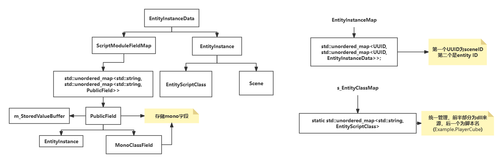

# C++游戏引擎

## 总览
该项目是一个基于OpenGL和C++开发的游戏引擎。

## 功能
- 支持2D和3D渲染
- 支持场景加载和模型导入
- 支持第三方3D，2D物理
- 支持PBR渲染，和通用shader
- 支持C#脚本，有完整的ui系统


## 程序入口
以Application.cpp为入口，Application类是整个程序的入口，负责初始化OpenGL以及各类其他模块。
``` c++
#pragma once


#ifdef CL_PLATFORM_WINDOWS

extern ChocoGL::Application* ChocoGL::CreateApplication();

int main(int argc,char** argv)
{

	ChocoGL::Log::Init();
	CL_CORE_WARN("Initialized Log!");
	int a = 5;
	CL_INFO("Hello! Var={0}", a);

	auto app = ChocoGL::CreateApplication();
	app->Run();
	delete app;
}

#endif // CL_PLATFORM_WINDOWS

```
#### Application类

``` c++
//核心变量
std::unique_ptr<Window> m_Window; 
bool m_Running = true, m_Minimized = false;

LayerStack m_LayerStack; 
ImGuiLayer* m_ImGuiLayer;
Timestep m_Timestep;

float m_LastFrameTime = 0.0f;
static Application* s_Instance;
//引擎主循环
void Run();

virtual void OnInit() {}
virtual void OnShutdown() {}
virtual void OnUpdate(Timestep ts) {}
// Handle callback function
virtual void OnEvent(Event& event);

void PushLayer(Layer* layer);
void PushOverlay(Layer* layer);
void RenderImGui();

std::string OpenFile(const char* filter = "All\0*.*\0") const;
std::string SaveFile(const char* filter = "All\0*.*\0") const;

static const char* GetConfigurationName();
static const char* GetPlatformName();

inline Window& GetWindow() { return *m_Window; }

static inline Application& Get() { return *s_Instance; }

float GetTime() const; // TODO: This should be in "Platform"
```

#### 引擎主循环
``` c++
 void Application::Run()
	{
		OnInit();
		while (m_Running)
		{
			if (!m_Minimized)
			{
				for (Layer* layer : m_LayerStack)
					layer->OnUpdate(m_Timestep);
				// Render ImGui on render thread
				Application* app = this;
				Renderer::Submit([app]() { app->RenderImGui(); });

				Renderer::WaitAndRender();
			}
			m_Window->OnUpdate();
			float time = GetTime();
			m_Timestep = time - m_LastFrameTime;
			m_LastFrameTime = time;
		}
		OnShutdown();
	}
```
## EVENT系统
通过调度器，事件分发器实现EVENT管理

``` c++
void Application::OnEvent(Event& event)
	{
		EventDispatcher dispatcher(event);
		dispatcher.Dispatch<WindowResizeEvent>(BIND_EVENT_FN(OnWindowResize));
		dispatcher.Dispatch<WindowCloseEvent>(BIND_EVENT_FN(OnWindowClose));


		for (auto it = m_LayerStack.end(); it != m_LayerStack.begin(); )
		{
			(*--it)->OnEvent(event);
			if (event.Handled)
				break;
		}
	}
```
其中event只用于提供输入，由调度器判断是否为指定的flag从而判断是否运行
```c++
class EventDispatcher
	{
		template<typename T>
		using EventFn = std::function<bool(T&)>;
	public:
		EventDispatcher(Event& event)
			: m_Event(event)
		{
		}

		template<typename T>
		bool Dispatch(EventFn<T> func)
		{
			if (m_Event.GetEventType() == T::GetStaticType())
			{
				m_Event.Handled = func(*(T*)&m_Event);
				return true;
			}
			return false;
		}
	private:
		Event& m_Event;
	};
```
用不同layer的OnEvent函数处理事件,把回调函数数据处理放到glfwsetcallback之外，实现高度模块化。
```c++
void EditorLayer::OnEvent(Event& e)
	{
		if (m_SceneState == SceneState::Edit)
		{
			if (m_ViewportPanelMouseOver)
				m_EditorCamera.OnEvent(e);

			m_EditorScene->OnEvent(e);
		}
		else if (m_SceneState == SceneState::Play)
		{
			m_RuntimeScene->OnEvent(e);
		}

		EventDispatcher dispatcher(e);
		dispatcher.Dispatch<KeyPressedEvent>(CL_BIND_EVENT_FN(EditorLayer::OnKeyPressedEvent));
		dispatcher.Dispatch<MouseButtonPressedEvent>(CL_BIND_EVENT_FN(EditorLayer::OnMouseButtonPressed));
	}
```

## 自定义share_ptr
RefCounted为大多数类的基类用于内部计数，通过继承RefCounted实现自定义的share_ptr。
通过重载运算符和模板编成完成设计
都使用creat显示构建类
``` c++
class RefCounted
	{
	public:
		void IncRefCount() const
		{
			m_RefCount++;
		}
		void DecRefCount() const
		{
			m_RefCount--;
		}

		uint32_t GetRefCount() const { return m_RefCount; }
	private:
		mutable uint32_t m_RefCount = 0; // TODO: atomic
	};

	template<typename T>
	class Ref
	{
	public:
		Ref()
			: m_Instance(nullptr)
		{
		}

		Ref(std::nullptr_t n)
			: m_Instance(nullptr)
		{
		}

		Ref(T* instance)
			: m_Instance(instance)
		{
			static_assert(std::is_base_of<RefCounted, T>::value, "Class is not RefCounted!");

			IncRef();
		}

		template<typename T2>
		Ref(const Ref<T2>& other)
		{

			m_Instance = (T*)other.m_Instance;
			IncRef();
		}
		//move Constructor
		template<typename T2>
		Ref(Ref<T2>&& other)
		{
			m_Instance = (T*)other.m_Instance;
			other.m_Instance = nullptr;
		}

		~Ref()
		{
			DecRef();
		}

		Ref(const Ref<T>& other)
			: m_Instance(other.m_Instance)
		{
			IncRef();
		}

		Ref& operator=(std::nullptr_t)
		{
			DecRef();
			m_Instance = nullptr;
			return *this;
		}

		Ref& operator=(const Ref<T>& other)
		{
			other.IncRef();
			DecRef();

			m_Instance = other.m_Instance;
			return *this;
		}

		template<typename T2>
		Ref& operator=(const Ref<T2>& other)
		{
			other.IncRef();
			DecRef();

			m_Instance = (T*)other.m_Instance;
			return *this;
		}

		template<typename T2>
		Ref& operator=(Ref<T2>&& other)
		{
			DecRef();

			m_Instance = (T*)other.m_Instance;

			other.m_Instance = nullptr;
			return *this;
		}

		operator bool() { return m_Instance != nullptr; }
		operator bool() const { return m_Instance != nullptr; }

		T* operator->() { return m_Instance; }
		const T* operator->() const { return m_Instance; }

		T& operator*() { return *m_Instance; }
		const T& operator*() const { return *m_Instance; }

		T* Raw() { return  m_Instance; }
		const T* Raw() const { return  m_Instance; }

		void Reset(T* instance = nullptr)
		{
			DecRef();
			m_Instance = instance;
		}
		//a way to use package to use 
		template<typename... Args>
		static Ref<T> Create(Args&&... args)
		{
			return Ref<T>(new T(std::forward<Args>(args)...));
		}
	private:
		void IncRef() const
		{
			if (m_Instance)
				m_Instance->IncRefCount();
		}

		void DecRef() const
		{
			if (m_Instance)
			{
				m_Instance->DecRefCount();
				if (m_Instance->GetRefCount() == 0)
				{
					delete m_Instance;
				}
			}
		}
		//friendly template;
		template<class T2>
		friend class Ref;
		T* m_Instance;
	};


```


```c++

template<typename... Args>
		//这里Args&& Args是一个类型参数 所以这里Args&&是万能引用 左值 右值都能行
		static Ref<T> Create(Args&&... args)
		{
			//return 返还值是右值别忘了
			return Ref<T>(new T(std::forward<Args>(args)...));
		}
```

## 自定义内存区
``` c++
struct Buffer
	{
		byte* Data;
		uint32_t Size;

		Buffer()
			: Data(nullptr), Size(0)
		{
		}

		Buffer(byte* data, uint32_t size)
			: Data(data), Size(size)
		{
		}
		static Buffer Copy(void* data, uint32_t size)
		{
			Buffer buffer;
			buffer.Allocate(size);
			memcpy(buffer.Data, data, size);
			return buffer;
		}
		void Allocate(uint32_t size)
		{
			delete[] Data;
			Data = nullptr;

			if (size == 0)
				return;

			Data = new byte[size];
			Size = size;
		}

		void ZeroInitialize()
		{
			if (Data)
				memset(Data, 0, Size);
		}

		template<typename T>
		T& Read(uint32_t offset = 0)
		{
			return *(T*)(Data + offset);
		}

		void Write(void* data, uint32_t size, uint32_t offset = 0)
		{
			CL_CORE_ASSERT(offset + size <= Size, "Buffer overflow!");
			memcpy(Data + offset, data, size);
		}


		operator bool() const
		{
			return Data;
		}

		byte& operator[](int index)
		{
			return Data[index];
		}

		byte operator[](int index) const
		{
			return Data[index];
		}

		template<typename T>
		T* As()
		{
			return (T*)Data;
		}

		inline uint32_t GetSize() const { return Size; }
	};
```
## 渲染队列
通过预处理的10mb内存作为内存池
```c++
RenderCommandQueue::RenderCommandQueue()
	{
		m_CommandBuffer = new uint8_t[10 * 1024 * 1024]; // 10mb buffer
		m_CommandBufferPtr = m_CommandBuffer;
		memset(m_CommandBuffer, 0, 10 * 1024 * 1024);
	}

```
内存池以，通用方法（转换函数指针，调用，调用析构）,lambda大小，lambda主体.
释放时，按照m_CommandCount释放，最后再让指针重新指向内存池开头

``` c++
template<typename FuncT>
		//new Submit
		static void Submit(FuncT&& func)
		{
			auto renderCmd = [](void* ptr) {
				auto pFunc = (FuncT*)ptr;
				(*pFunc)();


				pFunc->~FuncT();
				//std::destroy_at(pFunc);
			};
		
			auto storageBuffer = GetRenderCommandQueue().Allocate(renderCmd, sizeof(func));
			new (storageBuffer) FuncT(std::forward<FuncT>(func));
		}

	void* RenderCommandQueue::Allocate(RenderCommandFn fn, uint32_t size)

	{

		*(RenderCommandFn*)m_CommandBufferPtr = fn;

		m_CommandBufferPtr += sizeof(RenderCommandFn);

		*(uint32_t*)m_CommandBufferPtr = size;
		m_CommandBufferPtr += sizeof(uint32_t);

		void* memory = m_CommandBufferPtr;

		m_CommandBufferPtr += size;

		m_CommandCount++;
		return memory;
	}

	void RenderCommandQueue::Execute()
	{
		byte* buffer = m_CommandBuffer;

		for (uint32_t i = 0; i < m_CommandCount; i++)
		{
			RenderCommandFn function = *(RenderCommandFn*)buffer;
			buffer += sizeof(RenderCommandFn);

			uint32_t size = *(uint32_t*)buffer;
			buffer += sizeof(uint32_t);
			function(buffer);
			buffer += size;
		}
		m_CommandBufferPtr = m_CommandBuffer;
		m_CommandCount = 0;

	}

```
## shader解析
通过字符串简单分割处理 shader
```c++
	// Vertex Shader
		vstr = vertexSource.c_str();
		while (token = FindToken(vstr, "struct"))
			ParseUniformStruct(GetBlock(token, &vstr), ShaderDomain::Vertex);

		vstr = vertexSource.c_str();
		while (token = FindToken(vstr, "uniform"))
			ParseUniform(GetStatement(token, &vstr), ShaderDomain::Vertex);

		// Fragment Shader
		fstr = fragmentSource.c_str();
		while (token = FindToken(fstr, "struct"))
			ParseUniformStruct(GetBlock(token, &fstr), ShaderDomain::Pixel);

		fstr = fragmentSource.c_str();
		while (token = FindToken(fstr, "uniform"))
			ParseUniform(GetStatement(token, &fstr), ShaderDomain::Pixel);
```
#### 对于uniform
在进行变量处理存入**OpenGLShaderUniformBufferDeclaration**单个为**OpenGLShaderUniformDeclaration**
存入时顺便处理偏移值 便于绑定vao
``` c++
void OpenGLShaderUniformBufferDeclaration::PushUniform(OpenGLShaderUniformDeclaration* uniform)
	{
		uint32_t offset = 0;
		if (m_Uniforms.size())
		{
			OpenGLShaderUniformDeclaration* previous = (OpenGLShaderUniformDeclaration*)m_Uniforms.back();
			offset = previous->m_Offset + previous->m_Size;
		}
		uniform->SetOffset(offset);
		m_Size += uniform->GetSize();
		m_Uniforms.push_back(uniform);
	}
```
#### 对于struct
```c++
	ShaderUniformDeclaration* field = new OpenGLShaderUniformDeclaration(domain, OpenGLShaderUniformDeclaration::StringToType(type), name, count);
			uniformStruct->AddField(field);

	void AddField(ShaderUniformDeclaration* field)
		{
			m_Size += field->GetSize();
			uint32_t offset = 0;
			if (m_Fields.size())
			{
				ShaderUniformDeclaration* previous = m_Fields.back();
				offset = previous->GetOffset() + previous->GetSize();
			}
			field->SetOffset(offset);
			m_Fields.push_back(field);
		}
```

## Matrial和MatrialInstance 系统
无论时matrial 还是 matrialInstance  都是维护Buffer **m_VSUniformStorageBuffer**和**Buffer m_PSUniformStorageBuffer** 从shaer中读取Declaration。

```c++
if (m_Material->m_Shader->HasVSMaterialUniformBuffer())
		{
			const auto& vsBuffer = m_Material->m_Shader->GetVSMaterialUniformBuffer();
			m_VSUniformStorageBuffer.Allocate(vsBuffer.GetSize());
			memcpy(m_VSUniformStorageBuffer.Data, m_Material->m_VSUniformStorageBuffer.Data, vsBuffer.GetSize());
		}

		if (m_Material->m_Shader->HasPSMaterialUniformBuffer())
		{
			const auto& psBuffer = m_Material->m_Shader->GetPSMaterialUniformBuffer();
			m_PSUniformStorageBuffer.Allocate(psBuffer.GetSize());
			memcpy(m_PSUniformStorageBuffer.Data, m_Material->m_PSUniformStorageBuffer.Data, psBuffer.GetSize());
		}
```
**与此同时 matrialinstance 和matrial 相伴**
```c++
//matrialinstance 构造函数接受 matrial，每一个matrial 的instance都在matrial的一个vector中
MaterialInstance::MaterialInstance(const Ref<Material>& material, const std::string& name)
		: m_Material(material), m_Name(name)
	{
		m_Material->m_MaterialInstances.insert(this);
		AllocateStorage();
	}
```

#### 关于set
**matrial** 是为了保证基本的变量设置，而instance表示相同shader的uniform不同值，为了避免shader多次编译。


matrial 中查询并且写入buffer，在查询所有instance中变量是有重载这个值，没有的话才写入instance（相当于给一个预定义值）
```c++
void Set(const std::string& name, const T& value)
		{
			auto decl = FindUniformDeclaration(name);
			// CL_CORE_ASSERT(decl, "Could not find uniform with name '{0}'", name);
			CL_CORE_ASSERT(decl, "Could not find uniform with name 'x'");
			auto& buffer = GetUniformBufferTarget(decl);
			buffer.Write((byte*)&value, decl->GetSize(), decl->GetOffset());

			for (auto mi : m_MaterialInstances)
				mi->OnMaterialValueUpdated(decl);
		}
```
instance 中类似只要写入buffer并且压入覆写队列

#### bind
根据buffer 更改变量值
```c++
m_Material->m_Shader->Bind();

		if (m_VSUniformStorageBuffer)
			m_Material->m_Shader->SetVSMaterialUniformBuffer(m_VSUniformStorageBuffer);

		if (m_PSUniformStorageBuffer)
			m_Material->m_Shader->SetPSMaterialUniformBuffer(m_PSUniformStorageBuffer);

		m_Material->BindTextures();
		for (size_t i = 0; i < m_Textures.size(); i++)
		{
			auto& texture = m_Textures[i];
			if (texture)
				texture->Bind(i);
		}

```

## MESH


### 顶点索引阶段
项目中mesh系统基于matrial和assimp，基本是把assimp数据结构转换为自己的数据结构。其中包含大量顶点信息，如顶点坐标，法线，切线，uv，骨骼权重，骨骼索引等。
首先，它检查场景是否包含动画。如果场景包含动画，它将选择一个适用于动画的着色器；否则，它将选择一个适用于静态模型的着色器,创建一个材质，并计算出根节点相对于世界空间的逆变换矩阵。
```c++
	m_IsAnimated = scene->mAnimations != nullptr;
		m_MeshShader = m_IsAnimated ? Renderer::GetShaderLibrary()->Get("ChocoGLPBR_Anim") : Renderer::GetShaderLibrary()->Get("ChocoGLPBR_Static");
		m_BaseMaterial = Ref<Material>::Create(m_MeshShader);
		// m_MaterialInstance = Ref<MaterialInstance>::Create(m_BaseMaterial);
		m_InverseTransform = glm::inverse(Mat4FromAssimpMat4(scene->mRootNode->mTransformation));

```
接下来，它遍历场景中的所有网格。对于每个网格，它创建一个子网格，并将其添加到子网格列表中。它还计算出每个顶点和索引的总数。
```c++
for (size_t m = 0; m < scene->mNumMeshes; m++)
		{
			aiMesh* mesh = scene->mMeshes[m];

			Submesh& submesh = m_Submeshes.emplace_back();
			submesh.BaseVertex = vertexCount;
			submesh.BaseIndex = indexCount;
			submesh.MaterialIndex = mesh->mMaterialIndex;
			submesh.IndexCount = mesh->mNumFaces * 3;
			submesh.MeshName = mesh->mName.C_Str();

			vertexCount += mesh->mNumVertices;
			indexCount += submesh.IndexCount;

			CL_CORE_ASSERT(mesh->HasPositions(), "Meshes require positions.");
			CL_CORE_ASSERT(mesh->HasNormals(), "Meshes require normals.");

		for (size_t i = 0; i < mesh->mNumVertices; i++)
		{
			//处理vertices
		}
		for (size_t i = 0; i < mesh->mNumFaces; i++)
			{
				CL_CORE_ASSERT(mesh->mFaces[i].mNumIndices == 3, "Must have 3 indices.");
				Index index = { mesh->mFaces[i].mIndices[0], mesh->mFaces[i].mIndices[1], mesh->mFaces[i].mIndices[2] };
				m_Indices.push_back(index);

				if (!m_IsAnimated)
					m_TriangleCache[m].emplace_back(m_StaticVertices[index.V1 + submesh.BaseVertex], m_StaticVertices[index.V2 + submesh.BaseVertex], m_StaticVertices[index.V3 + submesh.BaseVertex]);

			}

		}

```
对于每个网格，它检查网格是否包含位置和法线数据，因为这些数据是必需的。同时，它遍历每个网格中的所有顶点。对于每个顶点，它提取出位置、法线、切线、副切线和纹理坐标，并将这些数据存储在一个顶点结构中。如果场景包含动画，它将使用一个包含动画数据的顶点结构；否则，它将使用一个静态的顶点结构。
### 材质阶段
通过aiscene迭代查询mesh的matrial数量遍历，以及重置纹理和材质列表
```c++
if (scene->HasMaterials())
{
	CL_MESH_LOG("---- Materials - {0} ----", filename);
	m_Textures.resize(scene->mNumMaterials);
	m_Materials.resize(scene->mNumMaterials);
	for (uint32_t i = 0; i < scene->mNumMaterials; i++)
	{
		auto aiMaterial = scene->mMaterials[i];
		auto aiMaterialName = aiMaterial->GetName();

		auto mi = Ref<MaterialInstance>::Create(m_BaseMaterialaiMaterialName.data);
		m_Materials[i] = mi;
```
根据对aiMaterial的检查，并且基于pbr理论进行粗糙度，金属度等等检查并且赋值给matrial。
并且使用整数作为标记判断是否拥有贴图。

```c++
mi->Set("u_NormalTexToggle", 0.0f);
if (aiMaterial->GetTexture(aiTextureType_NORMALS, 0, &aiTexPath)AI_SUCCESS)
{
	// TODO: Temp - this should be handled by Hazel's filesystem
	std::filesystem::path path = filename;
	auto parentPath = path.parent_path();
	parentPath /= std::string(aiTexPath.data);
	std::string texturePath = parentPath.string();
	CL_MESH_LOG(" Normal map path = {0}", texturePath);

	auto texture = Texture2D::Create(texturePath);
	if (texture->Loaded())
	{
		mi->Set("u_NormalTexture", texture);
		mi->Set("u_NormalTexToggle", 1.0f);
	}
	else
	{
		CL_CORE_ERROR(" Could not load texture: {0}", texturePath);
	}
}
else
{
	CL_MESH_LOG(" No normal map");
}

```
最后设定vbo和ibo
```c++
	VertexBufferLayout vertexLayout;
		if (m_IsAnimated)
		{
			m_VertexBuffer = VertexBuffer::Create(m_AnimatedVertices.data(), m_AnimatedVertices.size() * sizeof(AnimatedVertex));
			vertexLayout = {
				{ ShaderDataType::Float3, "a_Position" },
				{ ShaderDataType::Float3, "a_Normal" },
				{ ShaderDataType::Float3, "a_Tangent" },
				{ ShaderDataType::Float3, "a_Binormal" },
				{ ShaderDataType::Float2, "a_TexCoord" },
				{ ShaderDataType::Int4, "a_BoneIDs" },
				{ ShaderDataType::Float4, "a_BoneWeights" },
				};
		}
		else
		{
			m_VertexBuffer = VertexBuffer::Create(m_StaticVertices.data(), m_StaticVertices.size() * sizeof(Vertex));
			vertexLayout = {
				{ ShaderDataType::Float3, "a_Position" },
				{ ShaderDataType::Float3, "a_Normal" },
				{ ShaderDataType::Float3, "a_Tangent" },
				{ ShaderDataType::Float3, "a_Binormal" },
				{ ShaderDataType::Float2, "a_TexCoord" },
				};

		}

		m_IndexBuffer = IndexBuffer::Create(m_Indices.data(), m_Indices.size() * sizeof(Index));

		PipelineSpecification pipelineSpecification;
		pipelineSpecification.Layout = vertexLayout;
		m_Pipeline = Pipeline::Create(pipelineSpecification);

		m_Scene = scene;
```

## ScriptEngine系统

### 初始化 
项目思路按照unity，有两个c# dll，一个提供预知的函数方法，一个就是类似用户脚本dll。
```c++
void ScriptEngine::LoadChocoGLRuntimeAssembly(const std::string& path)
	{
		MonoDomain* domain = nullptr;
		bool cleanup = false;
		if (s_MonoDomain)
		{
			domain = mono_domain_create_appdomain("ChocoGL Runtime", nullptr);
			mono_domain_set(domain, false);
			
			cleanup = true;
		}

		s_CoreAssembly = LoadAssembly("assets/scripts/ChocoGL-ScriptCore.dll");
		s_CoreAssemblyImage = GetAssemblyImage(s_CoreAssembly);

		auto appAssembly = LoadAssembly(path);
		auto appAssemblyImage = GetAssemblyImage(appAssembly);
		ScriptEngineRegistry::RegisterAll();

		if (cleanup)
		{
			mono_domain_unload(s_MonoDomain);
			s_MonoDomain = domain;
		}

		s_AppAssembly = appAssembly;
		s_AppAssemblyImage = appAssemblyImage;
	}
```
其中在注册阶段会让c++函数和c#dll函数绑定
使用s_HasComponentFuncs和s_CreateComponentFuncs存储查询创建方法。
```c++
MonoType* type = mono_reflection_type_from_name("ChocoGL." #Type, s_CoreAssemblyImage);\
		if (type) {\
			uint32_t id = mono_type_get_type(type);\
			s_HasComponentFuncs[type] = [](Entity& entity) { return entity.HasComponent<Type>(); };\
			s_CreateComponentFuncs[type] = [](Entity& entity) { entity.AddComponent<Type>(); };\
		} else {\
			CL_CORE_ERROR("No C# component class found for " #Type "!");\
		}\
```
### ScriptEngine中基本结构

```c++
using ScriptModuleFieldMap = std::unordered_map<std::string, std::unordered_map<std::string, PublicField>>;
static std::unordered_map<std::string, EntityScriptClass> s_EntityClassMap;
using EntityInstanceMap = std::unordered_map<UUID, std::unordered_map<UUID, EntityInstanceData>>;

```

#### EntityScriptClass
```c++
struct EntityScriptClass
	{
		std::string FullName;
		std::string ClassName;
		std::string NamespaceName;
		MonoClass* Class = nullptr;
		MonoMethod* OnCreateMethod = nullptr;
		MonoMethod* OnDestroyMethod = nullptr;
		MonoMethod* OnUpdateMethod = nullptr;
		// Physics
		MonoMethod* OnCollision2DBeginMethod = nullptr;
		MonoMethod* OnCollision2DEndMethod = nullptr;
		MonoMethod* OnCollisionBeginMethod = nullptr;
		MonoMethod* OnCollisionEndMethod = nullptr;
		void InitClassMethods(MonoImage* image)
		{
			OnCreateMethod = GetMethod(image, FullName + ":OnCreate()");
			OnUpdateMethod = GetMethod(image, FullName + ":OnUpdate(single)");
			// Physics (Entity class)
			OnCollisionBeginMethod = GetMethod(s_CoreAssemblyImage, "ChocoGL.Entity:OnCollisionBegin(single)");
			OnCollisionEndMethod = GetMethod(s_CoreAssemblyImage, "ChocoGL.Entity:OnCollisionEnd(single)");
			OnCollision2DBeginMethod = GetMethod(s_CoreAssemblyImage, "ChocoGL.Entity:OnCollision2DBegin(single)");
			OnCollision2DEndMethod = GetMethod(s_CoreAssemblyImage, "ChocoGL.Entity:OnCollision2DEnd(single)");	
		}
	};
```
#### EntityInstanceData
```c++
struct EntityInstanceData
	{
		EntityInstance Instance;
		ScriptModuleFieldMap ModuleFieldMap;
	};
```
### EntityInstance
```c++
struct EntityInstance
	{
		EntityScriptClass* ScriptClass = nullptr;

		uint32_t Handle = 0;
		Scene* SceneInstance = nullptr;

		MonoObject* GetInstance();
	};
```
### PublicField
```c++
struct PublicField
	{
		std::string Name;
		FieldType Type;

		PublicField(const std::string& name, FieldType type);
		PublicField(const PublicField&) = delete;
		PublicField(PublicField&& other);
		~PublicField();

		void CopyStoredValueToRuntime();
		bool IsRuntimeAvailable() const;

		template<typename T>
		T GetStoredValue() const
		{
			T value;
			GetStoredValue_Internal(&value);
			return value;
		}

		template<typename T>
		void SetStoredValue(T value) const
		{
			SetStoredValue_Internal(&value);
		}
		template<typename T> 
		T GetRuntimeValue() const
		{
			T value;
			GetRuntimeValue_Internal(&value);
			return value;
		}

		template<typename T>
		void SetRuntimeValue(T value) const
		{
			SetRuntimeValue_Internal(&value);
		}

		void SetStoredValueRaw(void* src);
	private:
		EntityInstance* m_EntityInstance;
		MonoClassField* m_MonoClassField;
		uint8_t* m_StoredValueBuffer = nullptr;

		uint8_t* AllocateBuffer(FieldType type);
		void SetStoredValue_Internal(void* value) const;
		void GetStoredValue_Internal(void* outValue) const;
		void SetRuntimeValue_Internal(void* value) const;
		void GetRuntimeValue_Internal(void* outValue) const;

		friend class ScriptEngine;
	};
```


### 创建组件

在创建组件时，会调用s_CreateComponentFuncs[type]()方法。

#### 首先初始化 s_EntityClassMap中EntityScriptClass
```c++
EntityScriptClass& scriptClass = s_EntityClassMap[moduleName];
		scriptClass.FullName = moduleName;
		if (moduleName.find('.') != std::string::npos)
		{
			scriptClass.NamespaceName = moduleName.substr(0, moduleName.find_last_of('.'));
			scriptClass.ClassName = moduleName.substr(moduleName.find_last_of('.') + 1);
		}
		else
		{
			scriptClass.ClassName = moduleName;
		}

		scriptClass.Class = GetClass(s_AppAssemblyImage, scriptClass);
		scriptClass.InitClassMethods(s_AppAssemblyImage);

```
#### 之后是主要为了赋值s_EntityInstanceMap中的EntityInstanceData

其中主要还是存储mono字段
```c++
EntityInstanceData& entityInstanceData = s_EntityInstanceMap[scene->GetUUID()][id];
		EntityInstance& entityInstance = entityInstanceData.Instance;
		entityInstance.ScriptClass = &scriptClass;
		ScriptModuleFieldMap& moduleFieldMap = entityInstanceData.ModuleFieldMap;
		auto& fieldMap = moduleFieldMap[moduleName];
		
		// Save old fields
		std::unordered_map<std::string, PublicField> oldFields;
		oldFields.reserve(fieldMap.size());
		for (auto& [fieldName, field] : fieldMap)
			oldFields.emplace(fieldName, std::move(field));
		fieldMap.clear();

		// Retrieve public fields (TODO: cache these fields if the module is used more than once)
		{
			MonoClassField* iter;
			void* ptr = 0;
			while ((iter = mono_class_get_fields(scriptClass.Class, &ptr)) != NULL)
			{
				const char* name = mono_field_get_name(iter);
				uint32_t flags = mono_field_get_flags(iter);
				if ((flags & MONO_FIELD_ATTR_PUBLIC) == 0)
					continue;

				MonoType* fieldType = mono_field_get_type(iter);
				FieldType ChocoGLFieldType = GetChocoGLFieldType(fieldType);

				// TODO: Attributes
				MonoCustomAttrInfo* attr = mono_custom_attrs_from_field(scriptClass.Class, iter);

				if (oldFields.find(name) != oldFields.end())
				{
					fieldMap.emplace(name, std::move(oldFields.at(name)));
				}
				else
				{
					PublicField field = { name, ChocoGLFieldType };
					field.m_EntityInstance = &entityInstance;
					field.m_MonoClassField = iter;
					fieldMap.emplace(name, std::move(field));
				}
			}
		}

```
#### 之后会遍历StoredFields对mono字段赋值
```c++
if (ScriptEngine::ModuleExists(moduleName))
{
	auto storedFields = scriptComponent["StoredFields"];
	if (storedFields)
	{
		for (auto field : storedFields)
		{
			std::string name = field["Name"].as<std::string>();
			FieldType type = (FieldType)field["Type"].as<uint32_t>();
			EntityInstanceData& data = ScriptEngine::GetEntityInstanceData(m_Scene->GetUUID(), uuid);
			auto& moduleFieldMap = data.ModuleFieldMap;
			auto& publicFields = moduleFieldMap[moduleName];
			if (publicFields.find(name) == publicFields.end())
			{
				PublicField pf = { name, type };
				publicFields.emplace(name, std::move(pf));
			}
			auto dataNode = field["Data"];
			switch (type)
			{
			case FieldType::Float:
			{
				publicFields.at(name).SetStoredValue(dataNode.as<float>());
				break;
			}
			}
		}
	}
}

```

### 运行时的脚本系统
#### 在scene::play时切换,初始化c#中class
``` c++
auto view = m_Registry.view<ScriptComponent>();
for (auto entity : view)
{
	Entity e = { entity, this };
	if (ScriptEngine::ModuleExists(e.GetComponent<ScriptComponent>().ModuleName))
		ScriptEngine::InstantiateEntityClass(e);
}
```
####
对c#开始赋值字段，然后调用creat方法
``` c++
void ScriptEngine::InstantiateEntityClass(Entity entity)
	{
		Scene* scene = entity.m_Scene;
		UUID id = entity.GetComponent<IDComponent>().ID;
		auto& moduleName = entity.GetComponent<ScriptComponent>().ModuleName;

		EntityInstanceData& entityInstanceData = GetEntityInstanceData(scene->GetUUID(), id);
		EntityInstance& entityInstance = entityInstanceData.Instance;
		CL_CORE_ASSERT(entityInstance.ScriptClass);
		//handle 可以查询类或者其他字段
		entityInstance.Handle = Instantiate(*entityInstance.ScriptClass);

		//对c#类中ID变量赋值 如果有
		MonoProperty* entityIDPropery = mono_class_get_property_from_name(entityInstance.ScriptClass->Class, "ID");
		mono_property_get_get_method(entityIDPropery);
		MonoMethod* entityIDSetMethod = mono_property_get_set_method(entityIDPropery);
		void* param[] = { &id };
		CallMethod(entityInstance.GetInstance(), entityIDSetMethod, param);

		// Set all public fields to appropriate values
		ScriptModuleFieldMap& moduleFieldMap = entityInstanceData.ModuleFieldMap;
		if (moduleFieldMap.find(moduleName) != moduleFieldMap.end())
		{
			auto& publicFields = moduleFieldMap.at(moduleName);
			for (auto&[name, field] : publicFields)
				field.CopyStoredValueToRuntime();
		}

		// Call OnCreate function (if exists)
		OnCreateEntity(entity);
	}
```

调用create方法并且传入参数
```c++
void ScriptEngine::OnCreateEntity(Entity entity)
	{
		OnCreateEntity(entity.m_Scene->GetUUID(), entity.GetComponent<IDComponent>().ID);
	}

	void ScriptEngine::OnCreateEntity(UUID sceneID, UUID entityID)
	{
		EntityInstance& entityInstance = GetEntityInstanceData(sceneID, entityID).Instance;
		if (entityInstance.ScriptClass->OnCreateMethod)
			CallMethod(entityInstance.GetInstance(), entityInstance.ScriptClass->OnCreateMethod);
	}
```

### Physx

#### 初始化
和一般的引擎系统一样使用init方法初始化
构建PxFoundation 基础对象
和工厂s_PXPhysicsFactory
```c++
void Physics3D::Init()
	{
		CL_CORE_ASSERT(!s_PXFoundation, "PhysXManager::Init shouldn't be called more than once!");

		s_PXFoundation = PxCreateFoundation(PX_PHYSICS_VERSION, s_PXAllocator, s_PXErrorCallback);
		CL_CORE_ASSERT(s_PXFoundation, "PxCreateFoundation Failed!");

#if PHYSX_DEBUGGER
		s_PXPvd = PxCreatePvd(*s_PXFoundation);
		physx::PxPvdTransport* transport = physx::PxDefaultPvdSocketTransportCreate("localhost", 5425, 10);
		s_PXPvd->connect(*transport, physx::PxPvdInstrumentationFlag::eALL);
#endif
		s_PXPhysicsFactory = PxCreatePhysics(PX_PHYSICS_VERSION, *s_PXFoundation, physx::PxTolerancesScale(), true, s_PXPvd);
		CL_CORE_ASSERT(s_PXPhysicsFactory, "PxCreatePhysics Failed!");
	}
```